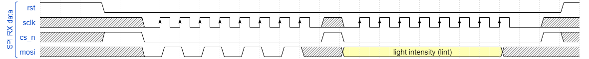
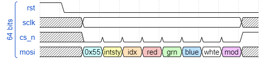

<!---

This file is used to generate your project datasheet. Please fill in the information below and delete any unused
sections.

You can also include images in this folder and reference them in the markdown. Each image must be less than
512 kb in size, and the combined size of all images must be less than 1 MB.
-->

## How it works
Color generator for RGBW LEDs, with generation of hue, tint and intensity based on a color index. Is also a direct SPI to 4 PWM channels converter, making it flexible to any different kind of use.

It is an SPI slave in Mode 0, with SPI protocol consisting of 8 byte long command, discriminated with a preamble sequence (see Protocol and Test for the description).

This payload is unpacked in different data: red, green, blue, white, bypass mode, intensity, color index. This data is then provided to the color wheel processor. It the bypass mode is activated, the RGBW info from the red, green, blue and white SPI bytes is directly provided as a PWM output in the respective channels.

If bypass mode is not active, only the white, intensity and color index are considered, from which the hue (RGB data) is generated based on the index, then a tint (hue + white) and then the intensity is applied, forming the final color. This is then applied to the PWM outpus to the respective channels. 

When bypass mode is not active (color wheel mode), then there is a latency proportional to the "rotation" of the color wheel, i.e. lower the number lower the latency. This is the laterncy of the color wheel processing unit (CwPU).

The system block diagram is as follow:

# Color wheel processor

The logic datapath of the CwPU is shown below:

The CwPU has all the data width of 8 bit, and is active when non in bypass mode. When active will take the index. Starting from zero, increments the hue progression ahd compare against this index (i.e. rotates the color wheel) to process at run time with no LUT, the corresponding requested hue. During the rotation, the RGB internal values will also change, increasing and decreasing to sweep all the combinations before matching the requested one. The final value will be used for the next step, which is the tint.

The next step is the sum of the white component, generating a tint, a white adjusted color. It will sum the white up to a maximum value, and the value is output to the intensity multiplier. Also the white is output to the multiplier.

The multiplication takes place with a single multiplicator unit, hence the local control takes care od the data load and synchonization, with 2 clock cycles per operation. Also the white is mutiplied. After this step, the output data of each component (R, G, B and W) are 16bit, but the 8 LSB are truncated, generating a final 24 bit color information and 8 bit white.

This data is used by the 4 channel PWM modulator.

When in bypass mode, the CwPU will only replicate the same RGBW info in input to the PWM modulator input in one clock cycle.

# SPI protocol

SPI is Mode 0 as shown in this timing diagram, highlighting the preable and first byte transfer:

While a whole packet must be compliant with the following diagram:

Which contains: 

1. preamble: 0x55
2. intensity: 0x00 - 0xFF
3. color index: 0x00 - 0xFF
4. red: 0x00 - 0xFF
5. green: 0x00 - 0xFF
6. blue: 0x00 - 0xFF
7. white: 0x00 - 0xFF
8. bypass mode: 0xA4 for the color generation, 0x21 bypass

Not that in between each byte is mandatory to toggle the CS signal, since in reality a full transaction is interpreted as a 8 individual single byte transactions.

## How to test

Source code for an STM32 MCU is provided in the folder "test". A python script will be provided to comminicate with the MCU over serial, which will convert the serial command into the SPI transaction. Is just a demo to help starting to use the color controller, but you can manually send SPI commands or edit the scripts.
Steps:
1. adapt the code to any MCU (with STM32 is easier to jsut port it)
2. Connect the MCU UART to a serial emulator
3. Run the script.
4. If using Linux: it is tested in Windows, so the only change is the serial port path in the python script

# What to expect on the outputs
- This is the output "color equation" without bypass:
Given the HUE ternary (r,g,b) processed from the index, where only 2 colors max are active at a time, i.e. no white, the final color is
RGBW = ((r,g,b)+w)*intensity

- This is the output "color equation" with bypass:
RGBW = spi(red, green, blue, white)
NO intensity, NO automatic white.

## External hardware

The MCU I used to test it are STM32, here I used 3 variants to help with flexibility: bluepill (STM32F103), the llll
Each project is in the test folder.
